#  LAMP Stack To-Do Application on AWS

[](https://aws.amazon.com/)
[](https://www.terraform.io/)
[](https://www.php.net/)
[](https://www.mysql.com/)
[](https://httpd.apache.org/)
[](https://github.com/features/actions)

## 🌐 **Live Application**
**🔗 [Access the Live To-Do App](http://54.171.64.158/)**

> A production-ready LAMP stack application deployed on AWS EC2 with Infrastructure as Code (IaC) using Terraform and automated CI/CD with GitHub Actions.

---

##  **Table of Contents**

- [ Project Overview](#-project-overview)
- [ Architecture](#️-architecture)
- [ Features](#-features)
- [ Technology Stack](#️-technology-stack)
- [ Project Structure](#-project-structure)
- [ Prerequisites](#-prerequisites)
- [ Quick Start](#-quick-start)
- [ Detailed Setup Guide](#-detailed-setup-guide)
- [ Deployment Workflow](#-deployment-workflow)
- [ Application Features](#-application-features)
- [ Security Implementation](#-security-implementation)
- [ AWS Well-Architected Framework](#-aws-well-architected-framework)
- [ Infrastructure Details](#-infrastructure-details)
- [ Local Development](#-local-development)
- [ Configuration](#-configuration)
- [ Monitoring & Logging](#-monitoring--logging)
- [ Scaling Considerations](#-scaling-considerations)
- [ Troubleshooting](#-troubleshooting)
- [ Cleanup](#-cleanup)
---

##  **Project Overview**

This project demonstrates a complete **DevOps workflow** for deploying a modern LAMP stack application on AWS. It showcases Infrastructure as Code (IaC) principles, automated CI/CD pipelines, and AWS cloud best practices.

### **What This Project Demonstrates:**
-  **Infrastructure as Code** with Terraform
-  **Automated CI/CD** with GitHub Actions
-  **AWS Cloud Architecture** following Well-Architected Framework
-  **Security Best Practices** with VPC, Security Groups, and encrypted storage
-  **Modern Web Development** with responsive PHP application
-  **Database Management** with MySQL integration
-  **Production Deployment** on AWS EC2

---

##  **Architecture**

### **High-Level Architecture Diagram**

```mermaid
graph TB
    subgraph "Internet"
        U[👥 Users]
    end
    
    subgraph "AWS Cloud - eu-west-1"
        subgraph "VPC: 10.0.0.0/16"
            subgraph "Public Subnet: 10.0.1.0/24"
                EIP[🌐 Elastic IP<br/>54.171.64.158]
                EC2[🖥️ EC2 Instance<br/>t3.micro<br/>Ubuntu 22.04]
                
                subgraph "EC2 Services"
                    APACHE[🌐 Apache HTTP Server<br/>Port 80/443]
                    PHP[⚙️ PHP 8.1<br/>Application Logic]
                    MYSQL[🗃️ MySQL 8.0<br/>Database Server]
                end
            end
            
            IGW[🌉 Internet Gateway]
            RT[📋 Route Table]
            SG[🔒 Security Group<br/>Ports: 22, 80, 443, 3306]
        end
    end
    
    subgraph "Development Workflow"
        GH[📦 GitHub Repository]
        GA[⚡ GitHub Actions]
        TF[🏗️ Terraform]
        S3[🪣 S3 Bucket<br/>Terraform State]
    end
    
    U --> EIP
    EIP --> EC2
    EC2 --> APACHE
    APACHE --> PHP
    PHP --> MYSQL
    
    GH --> GA
    GA --> TF
    TF --> EC2
    TF --> S3
    
    EC2 -.-> IGW
    IGW -.-> RT
    SG -.-> EC2
    
    style U fill:#e1f5fe
    style EC2 fill:#fff3e0
    style APACHE fill:#f3e5f5
    style PHP fill:#e8f5e8
    style MYSQL fill:#fff8e1
    style GA fill:#e3f2fd
    style TF fill:#f1f8e9
```



### **Network Architecture**

```mermaid
graph LR
    subgraph "Internet Gateway"
        IGW[🌉 Internet Gateway<br/>0.0.0.0/0]
    end
    
    subgraph "VPC: lamp-vpc (10.0.0.0/16)"
        subgraph "Public Subnet (10.0.1.0/24)"
            EC2[🖥️ EC2 Instance<br/>Private IP: 10.0.1.x<br/>Public IP: 54.171.64.158]
        end
        
        subgraph "Security Groups"
            SG[🔒 lamp-security-group<br/>SSH: 22<br/>HTTP: 80<br/>HTTPS: 443<br/>MySQL: 3306 (internal)]
        end
        
        RT[📋 Route Table<br/>0.0.0.0/0 → IGW]
    end
    
    IGW --> EC2
    RT --> IGW
    SG --> EC2
    
    style IGW fill:#e3f2fd
    style EC2 fill:#fff3e0
    style SG fill:#ffebee
    style RT fill:#f1f8e9
```

### **Application Flow Diagram**

```mermaid
flowchart TD
    A[👤 User visits http://54.171.64.158/] --> B[🌐 Apache Web Server]
    B --> C[⚙️ PHP Application Engine]
    C --> D{📝 Action Type?}
    
    D -->|View Tasks| E[📊 index.php]
    D -->|Add Task| F[➕ add.php]
    D -->|Delete Task| G[🗑️ delete.php]
    
    E --> H[🗄️ MySQL Database Query]
    F --> I[🗄️ MySQL Insert Operation]
    G --> J[🗄️ MySQL Delete Operation]
    
    H --> K[📋 Display Task List]
    I --> L[↩️ Redirect to Main Page]
    J --> M[↩️ Redirect to Main Page]
    
    K --> N[🎨 Styled HTML Response]
    L --> A
    M --> A
    N --> A
    
    style A fill:#e1f5fe
    style B fill:#f3e5f5
    style C fill:#e8f5e8
    style H fill:#fff8e1
    style I fill:#fff8e1
    style J fill:#fff8e1
    style N fill:#fce4ec
```



### **CI/CD Pipeline Flow**

```mermaid
flowchart LR
    subgraph "Developer Workflow"
        DEV[👨‍💻 Developer] --> COMMIT[📝 Git Commit]
        COMMIT --> PUSH[⬆️ Git Push to main]
    end
    
    subgraph "GitHub Actions Pipeline"
        PUSH --> TRIGGER[🔥 Workflow Trigger]
        TRIGGER --> TERRAFORM[🏗️ Terraform Job]
        TERRAFORM --> DEPLOY[🚀 Deploy Job]
    end
    
    subgraph "Terraform Operations"
        TERRAFORM --> INIT[terraform init]
        INIT --> VALIDATE[terraform validate]
        VALIDATE --> PLAN[terraform plan]
        PLAN --> APPLY[terraform apply]
    end
    
    subgraph "AWS Infrastructure"
        APPLY --> VPC[🏗️ Create VPC]
        VPC --> EC2[🖥️ Launch EC2]
        EC2 --> LAMP[⚙️ Install LAMP Stack]
    end
    
    subgraph "Application Deployment"
        DEPLOY --> SSH[🔗 SSH Connection]
        SSH --> COPY[📁 Copy App Files]
        COPY --> PERMS[🔒 Set Permissions]
        PERMS --> RESTART[🔄 Restart Services]
    end
    
    RESTART --> LIVE[🌐 Live Application<br/>http://54.171.64.158/]
    
    style DEV fill:#e3f2fd
    style TERRAFORM fill:#f1f8e9
    style DEPLOY fill:#fff3e0
    style LIVE fill:#e8f5e8
```



---

## ⚡ **Features**

### **Application Features**
-  **Add Tasks** - Create new to-do items with timestamps
-  **Delete Tasks** - Remove completed or unwanted tasks
-  **Responsive Design** - Mobile-first, works on all screen sizes
-  **Modern UI** - Clean, intuitive interface with smooth animations
-  **Real-time Updates** - Instant task management without page refresh delays
-  **SQL Injection Protection** - Prepared statements for database security

### **Infrastructure Features**
-  **Infrastructure as Code** - Complete AWS infrastructure defined in Terraform
-  **Automated Deployment** - GitHub Actions CI/CD pipeline
-  **Security First** - VPC isolation, security groups, encrypted storage
-  **High Availability Ready** - Architecture designed for scaling
-  **Monitoring Ready** - CloudWatch integration capability
-  **Cost Optimized** - Right-sized resources for optimal cost

---

##  **Technology Stack**

### **Frontend**
- **HTML5** - Semantic markup
- **CSS3** - Modern styling with Flexbox/Grid
- **Responsive Design** - Mobile-first approach

### **Backend**
- **PHP 8.1** - Server-side scripting
- **Apache 2.4** - Web server
- **MySQL 8.0** - Relational database

### **Infrastructure**
- **AWS EC2** - Compute instance (t3.micro)
- **AWS VPC** - Network isolation
- **Elastic IP** - Static public IP address
- **Security Groups** - Network-level firewall

### **DevOps & Tools**
- **Terraform** - Infrastructure as Code
- **GitHub Actions** - CI/CD automation
- **AWS CLI** - Command-line management
- **SSH** - Secure server access

### **Development**
- **Git** - Version control
- **Ubuntu 22.04 LTS** - Operating system
- **Vim/nano** - Server-side editing

---

## 📁 **Project Structure**

```
lamp-stack-application/
├── 📁 terraform/                 # Infrastructure as Code
│   ├──  main.tf               # Main Terraform configuration
│   ├──  variables.tf          # Input variables
│   ├──  outputs.tf            # Output values
│   └──  userdata.sh           # EC2 bootstrap script
│
├── 📁 app/                       # PHP Application
│   ├──  index.php             # Main application page
│   ├──  add.php               # Add task functionality
│   ├──  delete.php            # Delete task functionality
│   ├──  config.php            # Database configuration
│   └──  style.css             # Application styling
│
├── 📁 .github/workflows/         # CI/CD Pipeline
│   └──  deploy.yml            # GitHub Actions workflow
│
├──  .gitignore                # Git ignore rules
├──  README.md                 # Project documentation
└──  lamp-keypair              # SSH key pair (not in git)
```

---

##  **Prerequisites**

### **Required Tools**
- **AWS Account** with appropriate permissions
- **Terraform** >= 1.0 installed locally
- **AWS CLI** configured with credentials
- **Git** for version control
- **SSH client** for server access

### **AWS Permissions Required**
Your AWS user/role needs permissions for:
-  EC2 (instances, key pairs, security groups)
-  VPC (networking components)
-  S3 (Terraform state bucket)
-  IAM (if using roles)

### **GitHub Repository Setup**
-  GitHub repository with Actions enabled
-  GitHub Secrets configured (see setup guide)

---

##  **Quick Start**

### **1. Clone and Setup**
```bash
# Clone the repository
git clone https://github.com/yourusername/lamp-stack-application.git
cd lamp-stack-application

# Generate SSH key pair
ssh-keygen -t rsa -b 2048 -f lamp-keypair
```

### **2. Create S3 Bucket for Terraform State**
```bash
# Create a unique bucket name
aws s3 mb s3://lamp-stack-tfstate-yourname-$(date +%s) --region eu-west-1
```

### **3. Update Configuration**
Edit `terraform/main.tf` and update the S3 bucket name:
```hcl
backend "s3" {
  bucket = "your-actual-bucket-name-here"
  key    = "lamp-stack/terraform.tfstate"
  region = "eu-west-1"
}
```

### **4. Set GitHub Secrets**
In your GitHub repository, add these secrets:
- `AWS_ACCESS_KEY_ID` - Your AWS access key
- `AWS_SECRET_ACCESS_KEY` - Your AWS secret key
- `EC2_PUBLIC_KEY` - Contents of `lamp-keypair.pub`
- `EC2_PRIVATE_KEY` - Contents of `lamp-keypair`

### **5. Deploy**
```bash
# Commit and push to trigger deployment
git add .
git commit -m "Initial deployment"
git push origin main
```

### **6. Access Your Application**
Visit **[http://54.171.64.158/](http://54.171.64.158/)** (or your instance IP) after 5-10 minutes!

---

##  **Detailed Setup Guide**

### **Step 1: AWS Account Setup**

1. **Create AWS Account** (if you don't have one)
2. **Create IAM User** with programmatic access
3. **Attach Policies:**
   ```json
   {
     "Version": "2012-10-17",
     "Statement": [
       {
         "Effect": "Allow",
         "Action": [
           "ec2:*",
           "vpc:*",
           "iam:*",
           "s3:*"
         ],
         "Resource": "*"
       }
     ]
   }
   ```
4. **Configure AWS CLI:**
   ```bash
   aws configure
   # Enter your Access Key ID
   # Enter your Secret Access Key
   # Default region: eu-west-1
   # Default output format: json
   ```

### **Step 2: Local Environment Setup**

1. **Install Terraform:**
   ```bash
   # macOS
   brew install terraform
   
   # Ubuntu/Debian
   sudo apt-get update && sudo apt-get install -y gnupg software-properties-common
   wget -O- https://apt.releases.hashicorp.com/gpg | sudo gpg --dearmor -o /usr/share/keyrings/hashicorp-archive-keyring.gpg
   sudo apt-add-repository "deb [signed-by=/usr/share/keyrings/hashicorp-archive-keyring.gpg] https://apt.releases.hashicorp.com $(lsb_release -cs) main"
   sudo apt-get update && sudo apt-get install terraform
   
   # Windows (Chocolatey)
   choco install terraform
   ```

2. **Verify Installation:**
   ```bash
   terraform --version
   aws --version
   ```

### **Step 3: SSH Key Generation**

```bash
# Generate key pair
ssh-keygen -t rsa -b 2048 -f lamp-keypair

# Verify keys created
ls -la lamp-keypair*
# Should show: lamp-keypair (private) and lamp-keypair.pub (public)

# View public key (needed for GitHub secrets)
cat lamp-keypair.pub
```

### **Step 4: Terraform State Bucket**

```bash
# Create unique bucket name
BUCKET_NAME="lamp-stack-tfstate-$(whoami)-$(date +%s)"
echo "Bucket name: $BUCKET_NAME"

# Create bucket
aws s3 mb s3://$BUCKET_NAME --region eu-west-1

# Enable versioning (recommended)
aws s3api put-bucket-versioning \
  --bucket $BUCKET_NAME \
  --versioning-configuration Status=Enabled

# Enable encryption
aws s3api put-bucket-encryption \
  --bucket $BUCKET_NAME \
  --server-side-encryption-configuration \
  '{
    "Rules": [
      {
        "ApplyServerSideEncryptionByDefault": {
          "SSEAlgorithm": "AES256"
        }
      }
    ]
  }'
```

### **Step 5: GitHub Repository Setup**

1. **Create Repository** on GitHub
2. **Clone Repository:**
   ```bash
   git clone https://github.com/mangucletus/lamp-stack-application.git
   cd lamp-stack-application
   ```

3. **Add Project Files** (use the files from this repository)

4. **Configure GitHub Secrets:**
   - Go to your repository on GitHub
   - Click **Settings** → **Secrets and variables** → **Actions**
   - Click **New repository secret**
   - Add each secret:

   | Secret Name | Value | How to Get |
   |------------|-------|------------|
   | `AWS_ACCESS_KEY_ID` | Your AWS access key | From AWS IAM console |
   | `AWS_SECRET_ACCESS_KEY` | Your AWS secret key | From AWS IAM console |
   | `EC2_PUBLIC_KEY` | Contents of `lamp-keypair.pub` | `cat lamp-keypair.pub` |
   | `EC2_PRIVATE_KEY` | Contents of `lamp-keypair` | `cat lamp-keypair` |

### **Step 6: Manual Testing (Optional)**

Before using GitHub Actions, test locally:

```bash
cd terraform

# Initialize Terraform
terraform init

# Validate configuration
terraform validate

# Plan deployment
terraform plan -var="public_key=$(cat ../lamp-keypair.pub)"

# Apply (if plan looks good)
terraform apply -var="public_key=$(cat ../lamp-keypair.pub)"

# Get outputs
terraform output
```

---

##  **Deployment Workflow**

### **GitHub Actions Pipeline**

The deployment happens automatically when you push to the `main` branch:

```mermaid
sequenceDiagram
    participant Dev as 👨‍💻 Developer
    participant GH as 📦 GitHub
    participant GA as ⚡ GitHub Actions
    participant AWS as ☁️ AWS
    participant EC2 as 🖥️ EC2 Instance

    Dev->>GH: git push origin main
    GH->>GA: Trigger workflow
    GA->>GA: Setup Terraform
    GA->>AWS: terraform init
    GA->>AWS: terraform validate
    GA->>AWS: terraform plan
    GA->>AWS: terraform apply
    AWS->>EC2: Launch instance
    EC2->>EC2: Install LAMP stack
    GA->>EC2: SSH deployment
    EC2->>EC2: Configure application
    GA->>Dev: Deployment complete ✅
```



### **Workflow Stages**

1. **🔍 Validation Stage** (Pull Requests)
   - Terraform syntax validation
   - Security checks
   - Plan review

2. **🏗️ Infrastructure Stage** (Main branch)
   - Terraform initialization
   - Resource planning
   - Infrastructure provisioning

3. **🚀 Deployment Stage**
   - Wait for EC2 readiness
   - SSH connection establishment
   - Application file deployment
   - Service configuration

4. **✅ Verification Stage**
   - Health checks
   - Service status verification
   - Application accessibility

---

##  **Application Features**

### **User Interface**

The application features a modern, responsive design:

- **🎨 Beautiful Design** - Modern gradient backgrounds and smooth animations
- **📱 Mobile Responsive** - Optimized for all screen sizes
- **⚡ Fast Loading** - Lightweight CSS and optimized images
- **🔒 User Friendly** - Intuitive interface with clear call-to-actions

### **Functionality**

#### **Task Management**
```php
// Add Task (add.php)
if ($_SERVER["REQUEST_METHOD"] == "POST" && !empty($_POST['task'])) {
    $task = trim($_POST['task']);
    $stmt = $conn->prepare("INSERT INTO tasks (task) VALUES (?)");
    $stmt->bind_param("s", $task);
    $stmt->execute();
}

// Delete Task (delete.php)
if (isset($_GET['id']) && is_numeric($_GET['id'])) {
    $id = intval($_GET['id']);
    $stmt = $conn->prepare("DELETE FROM tasks WHERE id = ?");
    $stmt->bind_param("i", $id);
    $stmt->execute();
}
```

#### **Database Schema**
```sql
CREATE TABLE tasks (
    id INT AUTO_INCREMENT PRIMARY KEY,
    task VARCHAR(255) NOT NULL,
    created_at TIMESTAMP DEFAULT CURRENT_TIMESTAMP
);
```

### **Security Features**

- **🔒 SQL Injection Protection** - Prepared statements for all database queries
- **🛡️ XSS Prevention** - Input sanitization with `htmlspecialchars()`
- **🔐 CSRF Protection** - Form validation and secure redirects
- **🌐 Input Validation** - Server-side validation for all inputs

---

##  **Security Implementation**

### **Network Security**

#### **VPC Configuration**
```hcl
resource "aws_vpc" "lamp_vpc" {
  cidr_block           = "10.0.0.0/16"
  enable_dns_hostnames = true
  enable_dns_support   = true
}
```

#### **Security Groups**
```hcl
resource "aws_security_group" "lamp_sg" {
  # SSH (22) - Restricted to your IP in production
  ingress {
    from_port   = 22
    to_port     = 22
    protocol    = "tcp"
    cidr_blocks = ["0.0.0.0/0"]  # Restrict this in production
  }
  
  # HTTP (80) - Public web access
  ingress {
    from_port   = 80
    to_port     = 80
    protocol    = "tcp"
    cidr_blocks = ["0.0.0.0/0"]
  }
  
  # MySQL (3306) - Internal only
  ingress {
    from_port   = 3306
    to_port     = 3306
    protocol    = "tcp"
    cidr_blocks = ["10.0.0.0/16"]  # VPC internal only
  }
}
```

### **Data Security**

- **🔐 Encrypted EBS Volumes** - All storage encrypted at rest
- **🔒 Database Security** - MySQL with secure password and local-only access
- **🛡️ Application Security** - Prepared statements prevent SQL injection

### **Access Security**

- **🗝️ SSH Key Authentication** - No password authentication
- **🔐 IAM Roles** - Least privilege access principles
- **🌐 HTTPS Ready** - SSL/TLS termination capability

### **Security Best Practices Implemented**

1. **Network Isolation** - Private subnet for database tier (when scaled)
2. **Principle of Least Privilege** - Minimal required permissions
3. **Encryption** - Data encrypted in transit and at rest
4. **Secure Configurations** - Hardened server configurations
5. **Regular Updates** - Automated security patching capability

---

##  **AWS Well-Architected Framework**

This project follows AWS Well-Architected Framework principles:

### **🛡️ Security Pillar**
-  **Identity and Access Management** - IAM roles and policies
-  **Detective Controls** - CloudWatch logging ready
-  **Infrastructure Protection** - VPC and Security Groups
-  **Data Protection** - Encrypted storage and secure transmission
-  **Incident Response** - Automated backup and recovery capabilities

### ** Reliability Pillar**
-  **Foundations** - Well-architected VPC design
-  **Workload Architecture** - Stateless application design
-  **Change Management** - Infrastructure as Code with Terraform
-  **Failure Management** - Automated recovery procedures

### **⚡ Performance Efficiency Pillar**
-  **Selection** - Right-sized EC2 instances (t3.micro for demo)
-  **Review** - Regular performance monitoring capability
-  **Monitoring** - CloudWatch integration ready
-  **Tradeoffs** - Balanced cost vs. performance decisions

### ** Cost Optimization Pillar**
-  **Expenditure Awareness** - Resource tagging for cost tracking
-  **Cost-Effective Resources** - Appropriate instance sizing
-  **Matching Supply and Demand** - Auto-scaling ready architecture
-  **Optimizing Over Time** - Regular cost review processes

### ** Operational Excellence Pillar**
-  **Prepare** - Infrastructure as Code with Terraform
-  **Operate** - Automated deployment with GitHub Actions
-  **Evolve** - Continuous integration and deployment

---

##  **Infrastructure Details**

### **Compute Resources**

| Resource | Type | Specification | Purpose |
|----------|------|---------------|---------|
| **EC2 Instance** | t3.micro | 1 vCPU, 1 GB RAM | Web application hosting |
| **EBS Volume** | gp3 | 20 GB, Encrypted | Operating system and application storage |
| **Elastic IP** | Standard | Static IP | Consistent public access |

### **Network Configuration**

| Component | Configuration | Purpose |
|-----------|---------------|---------|
| **VPC** | 10.0.0.0/16 | Network isolation |
| **Public Subnet** | 10.0.1.0/24 | Internet-accessible resources |
| **Internet Gateway** | Attached to VPC | Internet connectivity |
| **Route Table** | 0.0.0.0/0 → IGW | Public internet routing |
| **Security Group** | Ports 22,80,443,3306 | Network access control |

### **Database Configuration**

```bash
# MySQL 8.0 Configuration
Server: localhost
Database: todoapp
User: root
Password: SecurePass123! (change in production)
Port: 3306 (internal only)

# Table Structure
Table: tasks
- id (INT, AUTO_INCREMENT, PRIMARY KEY)
- task (VARCHAR(255), NOT NULL)
- created_at (TIMESTAMP, DEFAULT CURRENT_TIMESTAMP)
```

### **Service Configuration**

```bash
# Apache Configuration
Document Root: /var/www/html/
Configuration: /etc/apache2/
Modules: mod_php, mod_rewrite
Port: 80 (HTTP), 443 (HTTPS ready)

# PHP Configuration
Version: PHP 8.1
Extensions: php-mysql, php-mbstring, php-xml
Configuration: /etc/php/8.1/apache2/php.ini

# System Services
Apache: systemctl status apache2
MySQL: systemctl status mysql
SSH: systemctl status ssh
```

---

##  **Local Development**

### **Setting Up Local Environment**

1. **Install LAMP Stack Locally:**
   ```bash
   # Ubuntu/Debian
   sudo apt update
   sudo apt install apache2 mysql-server php php-mysql libapache2-mod-php
   
   # macOS (using Homebrew)
   brew install httpd mysql php
   
   # Enable services
   sudo systemctl start apache2
   sudo systemctl start mysql
   ```

2. **Configure MySQL:**
   ```bash
   sudo mysql_secure_installation
   mysql -u root -p
   
   # Create database and table
   CREATE DATABASE todoapp;
   USE todoapp;
   CREATE TABLE tasks (
       id INT AUTO_INCREMENT PRIMARY KEY,
       task VARCHAR(255) NOT NULL,
       created_at TIMESTAMP DEFAULT CURRENT_TIMESTAMP
   );
   ```

3. **Deploy Application Locally:**
   ```bash
   # Copy application files
   sudo cp app/* /var/www/html/
   
   # Set permissions
   sudo chown -R www-data:www-data /var/www/html/
   sudo chmod -R 755 /var/www/html/
   
   # Update config.php for local settings
   ```

### **Development Workflow**

1. **Make Changes** to application files in `app/` directory
2. **Test Locally** on your development environment
3. **Commit Changes** to git
4. **Push to Main** to trigger automated deployment

---

##  **Configuration**

### **Environment Variables**

```bash
# Terraform Variables (terraform/variables.tf)
AWS_REGION=eu-west-1
INSTANCE_TYPE=t3.micro
KEY_NAME=lamp-keypair

# Application Configuration (app/config.php)
DB_HOST=localhost
DB_USER=root
DB_PASSWORD=SecurePass123!
DB_NAME=todoapp
```

### **Customization Options**

#### **Instance Sizing**
```hcl
# In terraform/variables.tf
variable "instance_type" {
  description = "EC2 instance type"
  type        = string
  default     = "t3.micro"  # Change to t3.small, t3.medium, etc.
}
```

#### **Database Configuration**
```bash
# In terraform/userdata.sh
mysql -u root -pSecurePass123! -e "CREATE USER 'appuser'@'localhost' IDENTIFIED BY 'newpassword';"
mysql -u root -pSecurePass123! -e "GRANT ALL PRIVILEGES ON todoapp.* TO 'appuser'@'localhost';"
```

#### **Security Group Rules**
```hcl
# Add HTTPS support
ingress {
  from_port   = 443
  to_port     = 443
  protocol    = "tcp"
  cidr_blocks = ["0.0.0.0/0"]
}

# Restrict SSH access to your IP
ingress {
  from_port   = 22
  to_port     = 22
  protocol    = "tcp"
  cidr_blocks = ["YOUR_IP/32"]  # Replace with your actual IP
}
```

#### **Application Styling**
```css
/* Customize colors in app/style.css */
:root {
  --primary-color: #4CAF50;    /* Change primary color */
  --secondary-color: #45a049;  /* Change secondary color */
  --background-gradient: linear-gradient(135deg, #667eea 0%, #764ba2 100%);
}
```

---

##  **Monitoring & Logging**

### **CloudWatch Integration**

The infrastructure is ready for CloudWatch monitoring:

```hcl
# Add to main.tf for CloudWatch monitoring
resource "aws_cloudwatch_log_group" "lamp_logs" {
  name              = "/aws/ec2/lamp-stack"
  retention_in_days = 14
}

# CloudWatch agent configuration
resource "aws_cloudwatch_log_stream" "apache_access" {
  name           = "apache-access"
  log_group_name = aws_cloudwatch_log_group.lamp_logs.name
}
```

### **Application Logs**

```bash
# Key log locations on EC2 instance
/var/log/apache2/access.log    # Apache access logs
/var/log/apache2/error.log     # Apache error logs
/var/log/mysql/error.log       # MySQL error logs
/var/log/cloud-init-output.log # Instance initialization logs
/var/log/syslog               # System logs
```

### **Performance Metrics**

Monitor these key metrics:

- **🖥️ CPU Utilization** - Instance performance
- **💾 Memory Usage** - Application memory consumption
- **📊 Network I/O** - Traffic patterns
- **💽 Disk Usage** - Storage utilization
- **🌐 HTTP Response Times** - Application performance
- **🗄️ Database Connections** - MySQL performance

### **Health Check Implementation**

```php
// Add health check endpoint (health.php)
<?php
header('Content-Type: application/json');

$health = [
    'status' => 'healthy',
    'timestamp' => date('c'),
    'services' => []
];

// Check database connection
try {
    include 'config.php';
    $conn->query("SELECT 1");
    $health['services']['database'] = 'healthy';
} catch (Exception $e) {
    $health['services']['database'] = 'unhealthy';
    $health['status'] = 'unhealthy';
}

// Check disk space
$disk_free = disk_free_space('/');
$disk_total = disk_total_space('/');
$disk_usage = (($disk_total - $disk_free) / $disk_total) * 100;

$health['services']['disk'] = [
    'status' => $disk_usage < 80 ? 'healthy' : 'warning',
    'usage_percent' => round($disk_usage, 2)
];

echo json_encode($health, JSON_PRETTY_PRINT);
?>
```

---

##  **Scaling Considerations**

### **Horizontal Scaling Architecture**

```mermaid
graph TB
    subgraph "Load Balanced Architecture"
        ALB[🔄 Application Load Balancer]
        
        subgraph "Auto Scaling Group"
            EC2A[🖥️ EC2 Instance A]
            EC2B[🖥️ EC2 Instance B]
            EC2C[🖥️ EC2 Instance C]
        end
        
        subgraph "Database Tier"
            RDS[🗄️ RDS MySQL<br/>Multi-AZ]
            REDIS[⚡ ElastiCache Redis<br/>Session Store]
        end
        
        subgraph "Storage"
            S3[🪣 S3 Bucket<br/>Static Assets]
            EFS[📁 EFS<br/>Shared Files]
        end
    end
    
    ALB --> EC2A
    ALB --> EC2B
    ALB --> EC2C
    
    EC2A --> RDS
    EC2B --> RDS
    EC2C --> RDS
    
    EC2A --> REDIS
    EC2B --> REDIS
    EC2C --> REDIS
    
    EC2A --> S3
    EC2B --> S3
    EC2C --> S3
```



### **Production-Ready Enhancements**

#### **1. Database Scaling**
```hcl
# RDS MySQL with Multi-AZ
resource "aws_db_instance" "lamp_db" {
  identifier = "lamp-mysql"
  
  engine         = "mysql"
  engine_version = "8.0"
  instance_class = "db.t3.micro"
  
  allocated_storage     = 20
  max_allocated_storage = 100
  storage_encrypted     = true
  
  db_name  = "todoapp"
  username = "admin"
  password = var.db_password
  
  multi_az               = true
  backup_retention_period = 7
  backup_window          = "03:00-04:00"
  maintenance_window     = "sun:04:00-sun:05:00"
  
  vpc_security_group_ids = [aws_security_group.rds_sg.id]
  db_subnet_group_name   = aws_db_subnet_group.lamp_db_subnet_group.name
  
  skip_final_snapshot = false
  final_snapshot_identifier = "lamp-db-final-snapshot"
  
  tags = {
    Name = "lamp-mysql-db"
  }
}
```

#### **2. Load Balancer Configuration**
```hcl
# Application Load Balancer
resource "aws_lb" "lamp_alb" {
  name               = "lamp-alb"
  internal           = false
  load_balancer_type = "application"
  security_groups    = [aws_security_group.alb_sg.id]
  subnets           = [aws_subnet.public_subnet_a.id, aws_subnet.public_subnet_b.id]

  enable_deletion_protection = false

  tags = {
    Name = "lamp-alb"
  }
}

# Target Group
resource "aws_lb_target_group" "lamp_tg" {
  name     = "lamp-tg"
  port     = 80
  protocol = "HTTP"
  vpc_id   = aws_vpc.lamp_vpc.id

  health_check {
    enabled             = true
    healthy_threshold   = 2
    interval            = 30
    matcher             = "200"
    path                = "/health.php"
    port                = "traffic-port"
    protocol            = "HTTP"
    timeout             = 5
    unhealthy_threshold = 2
  }
}
```

#### **3. Auto Scaling Group**
```hcl
# Launch Template
resource "aws_launch_template" "lamp_lt" {
  name_prefix   = "lamp-"
  image_id      = local.ubuntu_ami_id
  instance_type = var.instance_type
  key_name      = aws_key_pair.lamp_keypair.key_name

  vpc_security_group_ids = [aws_security_group.lamp_sg.id]
  
  user_data = base64encode(file("${path.module}/userdata.sh"))

  block_device_mappings {
    device_name = "/dev/sda1"
    ebs {
      volume_size = 20
      volume_type = "gp3"
      encrypted   = true
    }
  }

  tag_specifications {
    resource_type = "instance"
    tags = {
      Name = "lamp-server"
    }
  }
}

# Auto Scaling Group
resource "aws_autoscaling_group" "lamp_asg" {
  name                = "lamp-asg"
  vpc_zone_identifier = [aws_subnet.public_subnet_a.id, aws_subnet.public_subnet_b.id]
  target_group_arns   = [aws_lb_target_group.lamp_tg.arn]
  health_check_type   = "ELB"

  min_size         = 2
  max_size         = 6
  desired_capacity = 2

  launch_template {
    id      = aws_launch_template.lamp_lt.id
    version = "$Latest"
  }

  tag {
    key                 = "Name"
    value               = "lamp-asg-instance"
    propagate_at_launch = true
  }
}
```

#### **4. CDN and Caching**
```hcl
# CloudFront Distribution
resource "aws_cloudfront_distribution" "lamp_cdn" {
  origin {
    domain_name = aws_lb.lamp_alb.dns_name
    origin_id   = "lamp-alb-origin"

    custom_origin_config {
      http_port              = 80
      https_port             = 443
      origin_protocol_policy = "http-only"
      origin_ssl_protocols   = ["TLSv1.2"]
    }
  }

  enabled = true
  
  default_cache_behavior {
    allowed_methods  = ["DELETE", "GET", "HEAD", "OPTIONS", "PATCH", "POST", "PUT"]
    cached_methods   = ["GET", "HEAD"]
    target_origin_id = "lamp-alb-origin"

    forwarded_values {
      query_string = false
      cookies {
        forward = "none"
      }
    }

    viewer_protocol_policy = "redirect-to-https"
    min_ttl                = 0
    default_ttl            = 3600
    max_ttl                = 86400
  }

  restrictions {
    geo_restriction {
      restriction_type = "none"
    }
  }

  viewer_certificate {
    cloudfront_default_certificate = true
  }
}
```

### **Performance Optimization**

#### **Application Level**
```php
// Enable PHP OPcache (in userdata.sh)
echo "opcache.enable=1" >> /etc/php/8.1/apache2/conf.d/10-opcache.ini
echo "opcache.memory_consumption=128" >> /etc/php/8.1/apache2/conf.d/10-opcache.ini
echo "opcache.max_accelerated_files=10000" >> /etc/php/8.1/apache2/conf.d/10-opcache.ini

// Database connection pooling
class DatabasePool {
    private static $connections = [];
    
    public static function getConnection() {
        if (empty(self::$connections)) {
            self::$connections[] = new mysqli($servername, $username, $password, $dbname);
        }
        return array_pop(self::$connections);
    }
    
    public static function returnConnection($conn) {
        self::$connections[] = $conn;
    }
}
```

#### **Database Optimization**
```sql
-- Add database indexes for better performance
CREATE INDEX idx_created_at ON tasks(created_at);
CREATE INDEX idx_task_search ON tasks(task(50));

-- MySQL configuration optimization
SET GLOBAL innodb_buffer_pool_size = 512M;
SET GLOBAL query_cache_type = ON;
SET GLOBAL query_cache_size = 64M;
```

---

## 🐛 **Troubleshooting**

### **Common Issues and Solutions**

#### **1. Terraform Issues**

**Error: AMI not found**
```bash
# Solution: Update AMI ID in main.tf
# Check available AMIs:
aws ec2 describe-images \
  --owners 099720109477 \
  --filters "Name=name,Values=ubuntu/images/hvm-ssd/ubuntu-22.04-amd64-server-*" \
  --query 'Images[*].[ImageId,Name,CreationDate]' \
  --output table \
  --region eu-west-1
```

**Error: S3 bucket not found**
```bash
# Solution: Create the bucket
aws s3 mb s3://your-bucket-name --region eu-west-1

# Verify bucket exists
aws s3 ls | grep your-bucket-name
```

**Error: SSH key authentication failed**
```bash
# Solution: Verify key format and permissions
chmod 600 lamp-keypair
ssh-keygen -l -f lamp-keypair.pub

# Test SSH connection
ssh -i lamp-keypair ubuntu@YOUR_INSTANCE_IP
```

#### **2. Application Issues**

**Database connection failed**
```bash
# Check MySQL service
sudo systemctl status mysql

# Check MySQL logs
sudo tail -f /var/log/mysql/error.log

# Test database connection
mysql -u root -pSecurePass123! -e "SELECT 1;"
```

**Apache not serving pages**
```bash
# Check Apache service
sudo systemctl status apache2

# Check Apache configuration
sudo apache2ctl configtest

# Check Apache logs
sudo tail -f /var/log/apache2/error.log

# Restart Apache
sudo systemctl restart apache2
```

**PHP errors**
```bash
# Check PHP configuration
php -i | grep error_log

# Enable PHP error reporting (development only)
echo "display_errors = On" | sudo tee -a /etc/php/8.1/apache2/php.ini
echo "error_reporting = E_ALL" | sudo tee -a /etc/php/8.1/apache2/php.ini

# Restart Apache after PHP changes
sudo systemctl restart apache2
```

#### **3. GitHub Actions Issues**

**Workflow fails at Terraform step**
```yaml
# Add debugging to workflow
- name: Debug Terraform
  run: |
    terraform version
    aws sts get-caller-identity
    aws s3 ls
```

**SSH connection timeout**
```bash
# Check security group rules
aws ec2 describe-security-groups --group-ids sg-xxxxxxxxx

# Verify instance is running
aws ec2 describe-instances --instance-ids i-xxxxxxxxx

# Test SSH locally
ssh -i lamp-keypair -o ConnectTimeout=10 ubuntu@YOUR_INSTANCE_IP
```

#### **4. Performance Issues**

**High CPU usage**
```bash
# Check running processes
top -p $(pgrep -d, -f "apache2|mysql")

# Check Apache status
sudo apache2ctl status

# Check MySQL processlist
mysql -u root -pSecurePass123! -e "SHOW PROCESSLIST;"
```

**Out of memory**
```bash
# Check memory usage
free -h

# Check swap usage
swapon --show

# Add swap file if needed
sudo fallocate -l 1G /swapfile
sudo chmod 600 /swapfile
sudo mkswap /swapfile
sudo swapon /swapfile
```

### **Debugging Commands**

```bash
# System health check
sudo systemctl status apache2 mysql ssh

# Network connectivity
curl -I http://localhost
netstat -tlnp | grep :80

# Disk space
df -h
du -sh /var/www/html/

# Process monitoring
ps aux | grep -E "(apache2|mysql)"

# Log monitoring
sudo tail -f /var/log/apache2/access.log
sudo tail -f /var/log/mysql/error.log
sudo tail -f /var/log/cloud-init-output.log
```

---

##  **Cleanup**

### **Destroy Infrastructure**

```bash
# Using Terraform (recommended)
cd terraform
terraform destroy -var="public_key=$(cat ../lamp-keypair.pub)"

# Verify resources are deleted
aws ec2 describe-instances --query 'Reservations[*].Instances[?State.Name!=`terminated`]'
```

### **Manual Cleanup (if needed)**

```bash
# List all resources with lamp-* tags
aws resourcegroupstaggingapi get-resources \
  --tag-filters Key=Name,Values=lamp-*

# Delete specific resources
aws ec2 terminate-instances --instance-ids i-xxxxxxxxx
aws ec2 delete-key-pair --key-name lamp-keypair
aws ec2 delete-security-group --group-id sg-xxxxxxxxx
aws ec2 delete-vpc --vpc-id vpc-xxxxxxxxx
```

### **S3 Bucket Cleanup**

```bash
# Remove all objects from bucket
aws s3 rm s3://your-bucket-name --recursive

# Delete bucket
aws s3 rb s3://your-bucket-name

# Verify cleanup
aws s3 ls
```

### **Cost Monitoring**

```bash
# Check current month costs
aws ce get-cost-and-usage \
  --time-period Start=2024-01-01,End=2024-01-31 \
  --granularity MONTHLY \
  --metrics BlendedCost \
  --group-by Type=DIMENSION,Key=SERVICE
```

---


### **Useful Links**

- **🔗 Live Application**: [http://54.171.64.158/](http://54.171.64.158/)
- **📦 GitHub Repository**: [https://github.com/mangucletus/lamp-stack-application](https://github.com/yourusername/lamp-stack-application)
- **📚 AWS Documentation**: [https://docs.aws.amazon.com/](https://docs.aws.amazon.com/)
- **🏗️ Terraform Documentation**: [https://www.terraform.io/docs](https://www.terraform.io/docs)
- **⚡ GitHub Actions Documentation**: [https://docs.github.com/en/actions](https://docs.github.com/en/actions)

